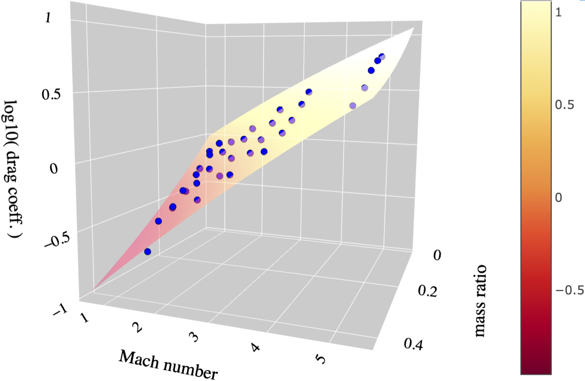

<html>
 

<b>Soumi De<small>1,2</small>, Morgan MacLeod<small>3</small>, Rosa Wallace Everson<small>4,5</small>, Andrea Antoni<small>6</small>, Ilya Mandel<small>7,8,9,5</small>, Enrico Ramirez-Ruiz<small>4,5</small></b>

 

<small>1</small><i>Department of Physics, Syracuse University, Syracuse, NY 13244, USA</i> <small>2</small><i>Kavli Institute for Theoretical Physics, University of California, Santa Barbara, CA 93106, USA</i> <small>3</small><i>Harvard Smithsonian Center for Astrophysics, Cambridge, MA, USA</i> <small>4</small><i>Department  of  Astronomy  and  Astrophysics,  University  of
California, Santa Cruz, CA 95064</i> <small>5</small><i>DARK, Niels Bohr Institute, University of Copenhagen, Blegdamsvej 17, 2100 Copenhagen, Denmark</i> <small>6</small><i>Department of Astronomy, University of California, Berkeley, CA 94720, USA</i> <small>7</small><i>School of Physics and Astronomy, Monash University, Clayton, VIC 3800, Australia</i> <small>8</small><i>OzGrav: The ARC Centre of Excellence for Gravitational Wave Discovery, Australia</i> <small>7</small><i>School of Physics and Astronomy, University of Birmingham, Edgbaston, Birmingham B15 2TT, United Kingdom</i>

 
 

This page is a companion to the paper arxiv:XXX.XXXX. We present visualizations of one of the hydrodynamical simulations presented in the paper and the fitting formulae derived from the mapping between the input parameters and results of the simulation suites.

<h1>
Hydrodynamical simulation movie
</h1>

Movie of simulation performed with ideal gas equation of state adiabatic constant &gamma; = 4/3, mass ratio <i>q</i>r = 0.1, and upstream Mach number <i>M</i>&infin; = 1.69 in the <i>wind-tunnel<\i> setup. The top panel shows the formation of the shock and the evolution of the flow past the compact object embedded in the envelope of its companion star. Plotted is the density in units of &rho;&infin; in the orbital (<i>x</i>-<i>y</i>) plane of the binary, with the white dot at the coordinate origin representing the embedded companion object. The lines with arrowheads in white represent streamlines following the velocity field in the flow. The bottom panel shows the time series of coefficients of accretion <i>C</i>a (in red) and drag <i>C</i>d (blue) for the full simulation. The gray vertical line tracks the instantaneous <i>C</i>a, <i>C</i>d values as the simulation progresses. The time quoted in the movie is in code units <i>R</i>a/<i>v</i>&infin;, where <i>R</i>a is the accretion radius and <i>v</i>&infin;; is the relative velocity of the flow past the embedded object.

<video width="640" height="480" controls>
<source src="hydro_sim_q0pt1_erho0pt47_movie.mp4" type="video/mp4">
</video>

 
 

 

<h1>
Fits
</h1>

Presented below are three-dimensional interactive plots showing fitting relations between the coefficient of accretion <i>C</i>a and coefficient of drag <i>C</i>d in terms of the mass ratio <i>q</i> and upstream Mach number <i>M</i>&infin; obtained on mapping the input parameters to the results from the hydrodynamical simulations.

<h2>
<i>C</i>a (<i>q</i>, <i>M</i>&infin;) from (<i>&Gamma;</i>, <i>&gamma;</i>) = (4/3, 4/3) simulations
</h2>

The red dots represent the <i>log</i>10<i>C</i>a results obtained from the (<i>&Gamma;</i>, <i>&gamma;</i>) = (4/3, 4/3) hydrodynamical simulations with <i>q</i> and <i>M</i>&infin; parameters. The three-dimensional surface shows the best fitting third-order polynomial relation of <i>log</i>10<i>C</i>a as a function of (<i>q</i>, <i>M</i>&infin;).

<a href="logmdot3_fit_to_runs_g43_nolfs.html" class="button" style="background:#2d81c5 0 0 no-repeat; color: #fff; border: solid 1px #474747; text-decoration: none;display: inline-block;font-size: 19px; width: 116px; height: 42px; text-align: center; line-height: 1.2; -webkit-border-radius: 1em; -moz-border-radius: 1em; box-shadow: 0 1px 0 0 #1f5a89; text-shadow: 0 1px rgba(0, 0, 0, 0.3); padding-left: 3px; padding-top: 3px; padding-bottom: 3px;">View<small> Interactive Plot</small></a>

 
 

<h2>
<i>C</i>d (<i>q</i>, <i>M</i>&infin;) from (<i>&Gamma;</i>, <i>&gamma;</i>) = (4/3, 4/3) simulations
</h2>

The red dots represent the <i>log</i>10<i>C</i>d results obtained from the (<i>&Gamma;</i>, <i>&gamma;</i>) = (4/3, 4/3) hydrodynamical simulations with <i>q</i> and <i>M</i>&infin; parameters. The three-dimensional surface shows the best fitting third-order polynomial relation of <i>log</i>10<i>C</i>d as a function of (<i>q</i>, <i>M</i>&infin;).

<a href="logdrag3_fit_to_runs_g43_nolfs.html" class="button" style="background:#2d81c5 0 0 no-repeat; color: #fff; border: solid 1px #474747; text-decoration: none;display: inline-block;font-size: 19px; width: 116px; height: 42px; text-align: center; line-height: 1.2; -webkit-border-radius: 1em; -moz-border-radius: 1em; box-shadow: 0 1px 0 0 #1f5a89; text-shadow: 0 1px rgba(0, 0, 0, 0.3); padding-left: 3px; padding-top: 3px; padding-bottom: 3px;">View<small> Interactive Plot</small></a>

 
 

<h2>
<i>C</i>a (<i>q</i>, <i>M</i>&infin;) from (<i>&Gamma;</i>, <i>&gamma;</i>) = (5/3, 5/3) simulations
</h2>

The red dots represent the <i>log</i>10<i>C</i>a results obtained from the (<i>&Gamma;</i>, <i>&gamma;</i>) = (5/3, 5/3) hydrodynamical simulations with <i>q</i> and <i>M</i>&infin; parameters. The three-dimensional surface shows the best fitting second-order polynomial relation of <i>log</i>10<i>C</i>a as a function of (<i>q</i>, <i>M</i>&infin;).

<a href="logmdot2_fit_to_runs_g53_nolfs.html" class="button" style="background:#2d81c5 0 0 no-repeat; color: #fff; border: solid 1px #474747; text-decoration: none;display: inline-block;font-size: 19px; width: 116px; height: 42px; text-align: center; line-height: 1.2; -webkit-border-radius: 1em; -moz-border-radius: 1em; box-shadow: 0 1px 0 0 #1f5a89; text-shadow: 0 1px rgba(0, 0, 0, 0.3); padding-left: 3px; padding-top: 3px; padding-bottom: 3px;">View<small> Interactive Plot</small></a>

 
 

<h2>
<i>C</i>d (<i>q</i>, <i>M</i>&infin;) from (<i>&Gamma;</i>, <i>&gamma;</i>) = (5/3, 5/3) simulations
</h2>

The red dots represent the <i>log</i>10<i>C</i>d results obtained from the (<i>&Gamma;</i>, <i>&gamma;</i>) = (5/3, 5/3) hydrodynamical simulations with <i>q</i> and <i>M</i>&infin; parameters. The three-dimensional surface shows the best fitting second-order polynomial relation of <i>log</i>10<i>C</i>d as a function of (<i>q</i>, <i>M</i>&infin;.

<a href="logdrag2_fit_to_runs_g53_nolfs.html" class="button" style="background:#2d81c5 0 0 no-repeat; color: #fff; border: solid 1px #474747; text-decoration: none;display: inline-block;font-size: 19px; width: 116px; height: 42px; text-align: center; line-height: 1.2; -webkit-border-radius: 1em; -moz-border-radius: 1em; box-shadow: 0 1px 0 0 #1f5a89; text-shadow: 0 1px rgba(0, 0, 0, 0.3); padding-left: 3px; padding-top: 3px; padding-bottom: 3px;">View<small> Interactive Plot</small></a>

 
 

<h3>
Acknowledgements
</h3>

<i>Software: </i> <a href="http://flash.uchicago.edu/site/flashcode/">FLASH</a>, <a href="https://yt-project.org/">yt</a>, <a href="https://plot.ly/">Plotly</a>, Matplotlib, <a href="https://www.astropy.org/">astropy</a>. Resources supporting this work were provided by the NASA High-End Computing (HEC) Program through the NASA Advanced Supercomputing (NAS) Division at Ames Research Center, by the Institute for Advanced Study, by the University of Copenhagen high-performance computing cluster funded by a grant from VILLUM FONDEN (project number 16599), and by Syracuse University. Any opinions, findings, and conclusions or recommendations expressed in this material are those of the authors and do not necessarily reflect the views of the National Science Foundation.

 
 

</html>
