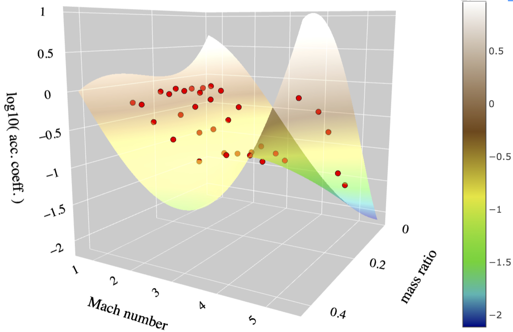
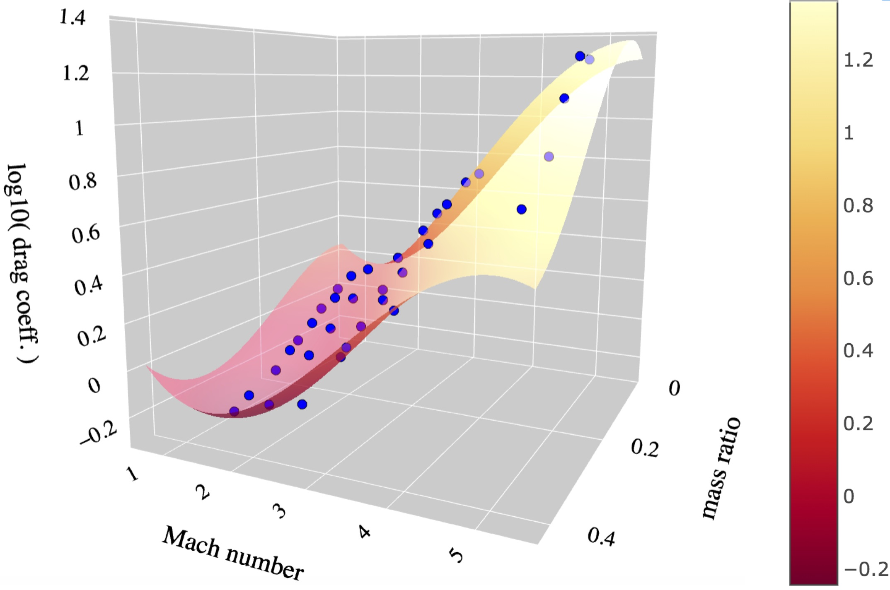
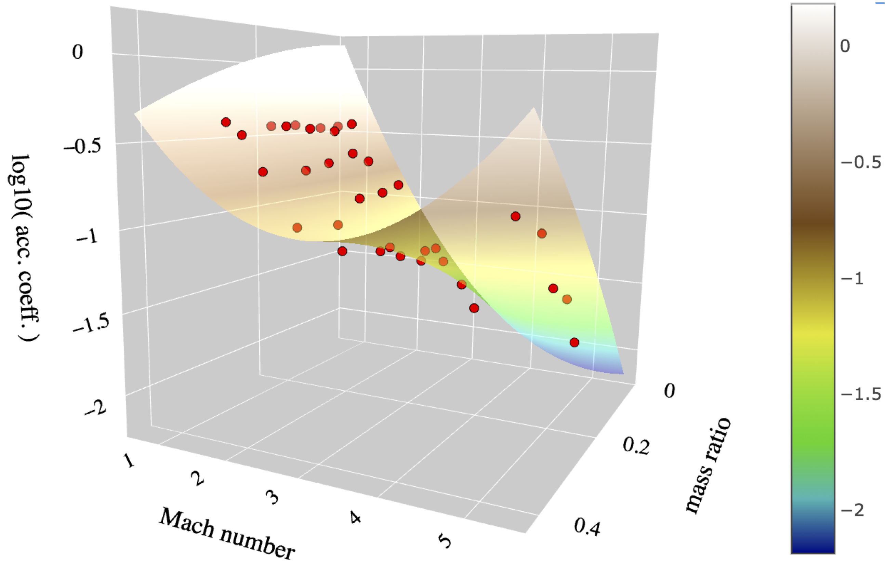
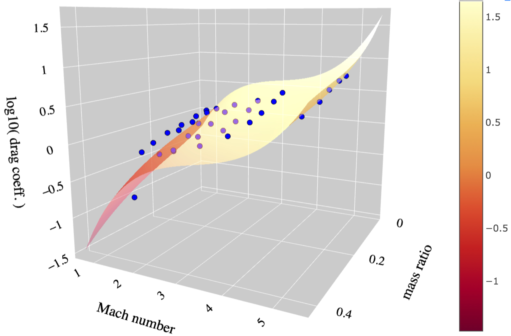

 

<h1>
Hydrodynamical simulation movie
</h1>
<video width="640" height="480" controls>
<source src="hydro_sim_q0pt1_erho0pt47_movie.mp4" type="video/mp4">
</video>

 
 

 

<h1>
Coefficient of accretion rate and drag fits
</h1>

<h2>
Ca (q, M&infin;) fit for (&Gamma;, &gamma;) = (4/3, 4/3) simulations
</h2>

<a href="logmdot3_fit_to_runs_g43_nolfs.html" class="button" style="background:#474747 no-repeat 25px center; background-image: none; color: #fff;text-decoration: none;font-family: Verdana,sans-serif;display: inline-block;font-size: 23px;padding: 15px 15px 15px 15px; -webkit-border-radius: 2px; -moz-border-radius: 2px; border-radius: 2px; box-shadow: 0 1px 0 0 #1f5a89; text-shadow: 0 1px rgba(0, 0, 0, 0.3);">Interactive plot</a>

 
<a href="logmdot3_fit_to_runs_g43_nolfs.html">
 
 

<h2>
<a href="logdrag3_fit_to_runs_g43_nolfs.html">Cd (q, M&infin;) fit for (&Gamma;, &gamma;) = (4/3, 4/3) simulations</a>
</h2>
 
<a href="logdrag3_fit_to_runs_g43_nolfs.html">
 
 

<h2>
<a href="logmdot2_fit_to_runs_g53_nolfs.html">Ca (q, M&infin;) fit for (&Gamma;, &gamma;) = (5/3, 5/3) simulations</a>
</h2>
 
<a href="logmdot2_fit_to_runs_g53_nolfs.html">
 
 

<h2>
<a href="logdrag3_fit_to_runs_g53_nolfs.html">Cd (q, M&infin;) fit for (&Gamma;, &gamma;) = (5/3, 5/3) simulations</a>
</h2>
 
<a href="logdrag3_fit_to_runs_g53_nolfs.html">
 
 
